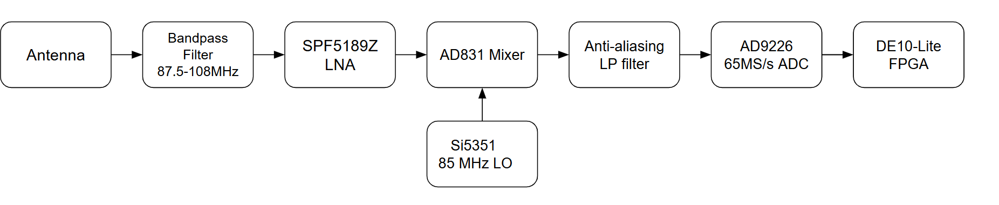
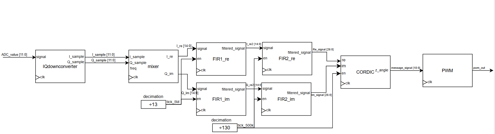
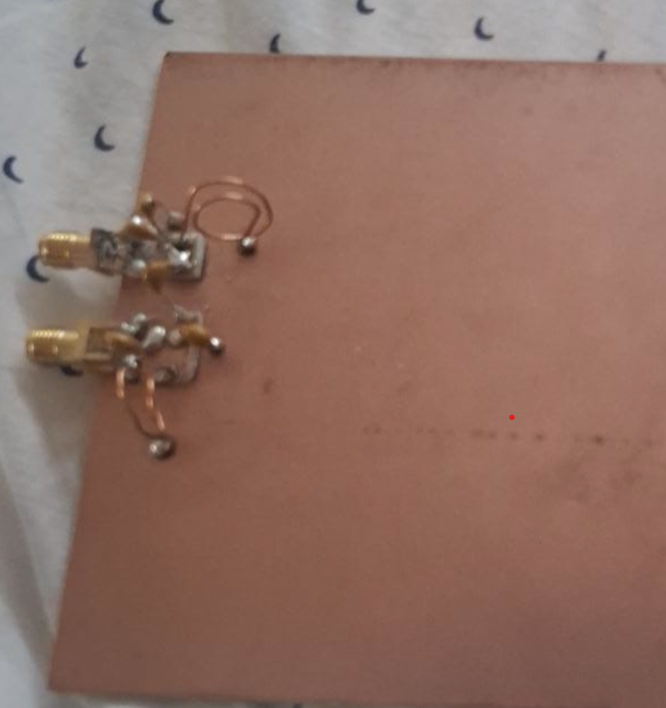
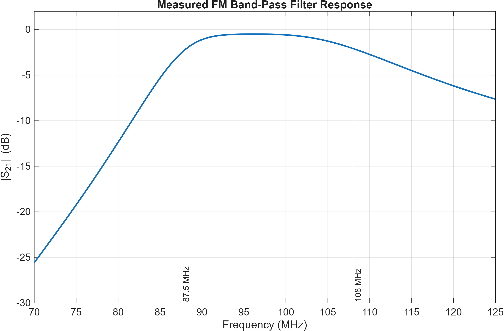
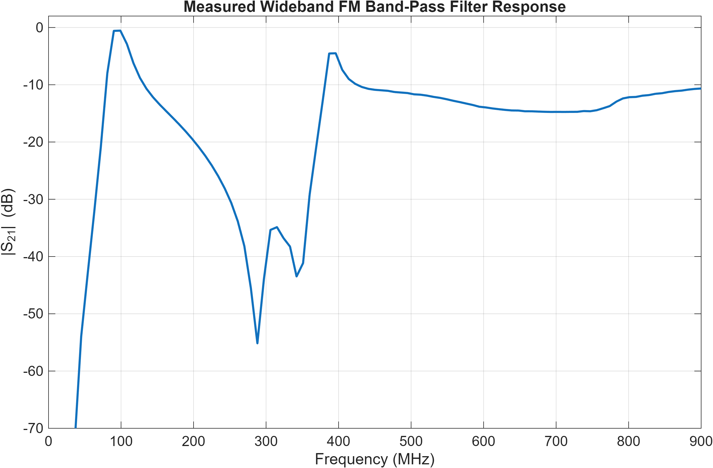
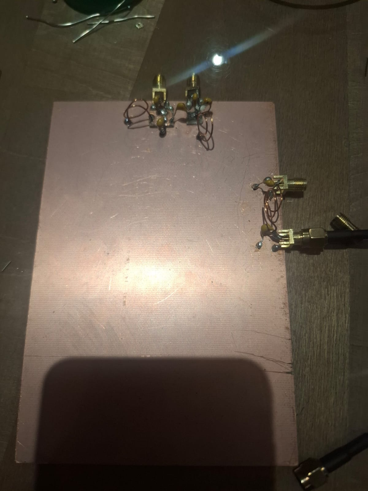
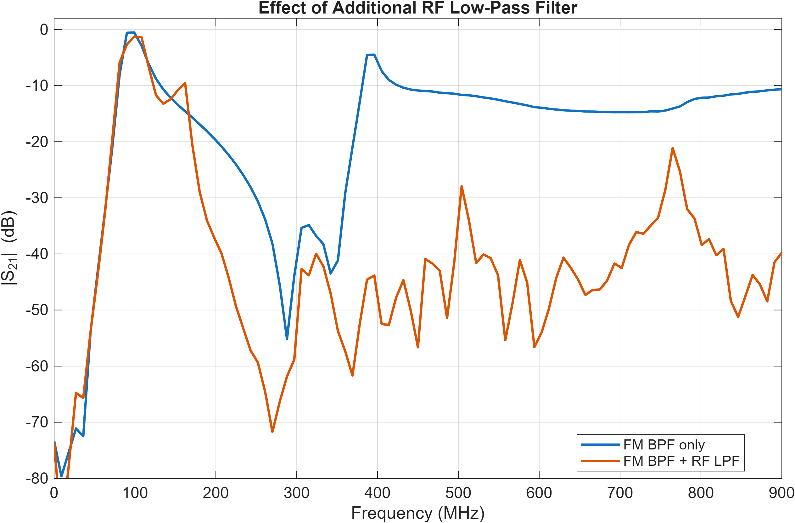

# FPGA-SDR

FPGA-based FM software-defined radio receiver with a custom analogue front end and real-time DSP implemented on an Intel MAX10 FPGA.

The receiver covers the commercial FM broadcast band and performs channel selection and FM demodulation digitally on an Intel MAX10 FPGA. The analogue front end performs RF filtering, amplification and downconversion before digitisation by an external ADC.

The completed system successfully receives multiple live FM radio stations and outputs demodulated audio through a PWM-based audio stage.

## Analogue Front End

The analogue front end receives the FM broadcast band using a dipole antenna before filtering and amplifying the signal.

An **85 MHz local oscillator** is used with an analogue mixer to translate the **87.5–108 MHz** RF spectrum to an intermediate-frequency range of approximately **2.5–23 MHz**.

The resulting signal is low-pass filtered before being sampled by an **AD9226 12-bit ADC at 65 MS/s**.

The analogue chain consists of:

- Dipole antenna
- Custom FM band-pass filter
- Low-noise amplifier
- AD831 active mixer
- 85 MHz local oscillator
- Custom post-mixer low-pass / anti-aliasing filter
- AD9226 12-bit ADC
  
---

## FPGA Digital Signal Processing Pipeline

The digitised IF signal is processed entirely in real time on the FPGA.

The signal is converted into complex I/Q samples using multiplication by a complex exponential, translating the spectrum into complex baseband. A tunable digital mixer is then used to select the desired FM station.

The I and Q channels pass through two stages of FIR filtering and decimation to reduce the sample rate while isolating the selected FM channel. A CORDIC-based phase detector is then used to recover the FM-modulated audio signal.

The recovered audio is converted to a PWM signal for output to an external analogue low-pass filter and audio amplifier before driving a speaker.

## Hardware

- Terasic DE10-Lite FPGA board
- Intel MAX10 FPGA
- AD9226 12-bit ADC
- AD831 active mixer
- Si5351 local oscillator
- SPF5189Z LNA
- Custom FM band-pass filter
- Custom post-mixer low-pass filter
- Dipole antenna
- PWM audio output stage
- Audio amplifier and speaker
- NanoVNA
- Oscilloscope
- Digital multimeter

## RF Filter Characterisation

### FM Band-Pass Filter

A custom LC band-pass filter was designed to pass the **87.5–108 MHz FM broadcast band** while attenuating unwanted out-of-band signals before amplification and mixing.

The filter was constructed using discrete components on copper-clad board and characterised using a NanoVNA.

  

A high-resolution S21 sweep around the FM band shows that the desired passband is achieved with relatively low insertion loss across most of the band.

A wider frequency sweep revealed additional unwanted resonances at higher frequencies. These are caused by practical non-idealities such as component parasitics, interconnect inductance and capacitance, and the physical construction of the discrete RF filter.

### Additional RF Low-Pass Filter

To suppress the unwanted high-frequency responses observed in the wideband measurement, an additional RF low-pass filter was cascaded with the FM band-pass filter.

The low-pass stage was designed to preserve the required FM broadcast band while providing substantially greater attenuation at higher frequencies.

The comparison below shows the measured S21 response before and after adding the additional low-pass stage.

The combined filter response retains the desired **87.5–108 MHz** passband while significantly reducing the unwanted high-frequency resonances.

This provided a cleaner RF spectrum to the following receiver stages and reduced the risk of unwanted out-of-band signals entering the mixer.

### Post-Mixer Anti-Aliasing Filter

A separate low-pass filter is used after the analogue mixer.

With an **85 MHz local oscillator**, the 87.5–108 MHz FM broadcast band is translated to approximately **2.5–23 MHz**. The post-mixer filter therefore passes the desired intermediate-frequency band while suppressing higher-frequency mixer products and limiting the bandwidth presented to the ADC.

This filter is separate from the RF low-pass filter used to suppress the high-frequency responses of the FM band-pass filter.

## Results

The completed receiver successfully receives approximately 10 FM broadcast stations at my test location.

Strong stations produce clear and intelligible audio with very little background noise, while weaker stations exhibit increased noise due to lower received signal strength.

The receiver was validated incrementally by testing the ADC interface, digital signal-processing stages, mixer frequency conversion and complete RF-to-audio signal chain.

## Implementation

The FPGA signal-processing pipeline was written in SystemVerilog.

Major DSP blocks include:

- Numerically controlled oscillator
- Complex digital mixer
- FIR filters
- Multistage decimation
- CORDIC-based FM demodulation
- PWM audio generation

The signal-processing blocks were implemented directly rather than using vendor DSP IP blocks.
