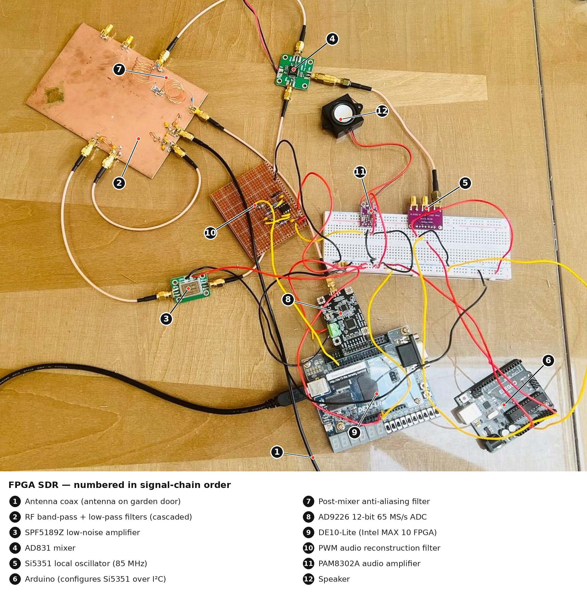
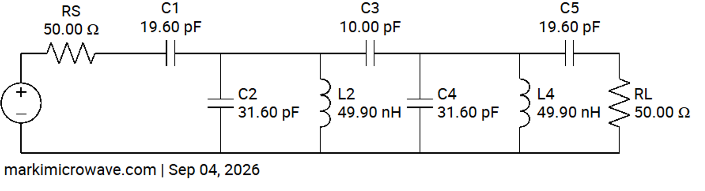
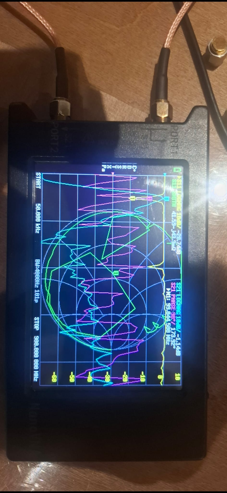
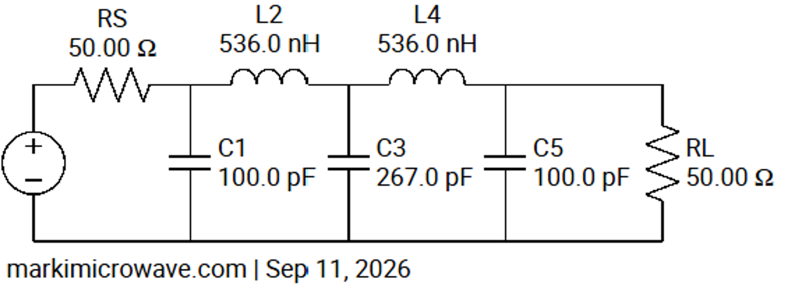
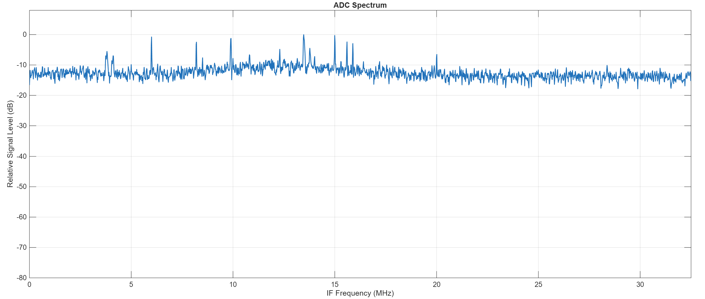
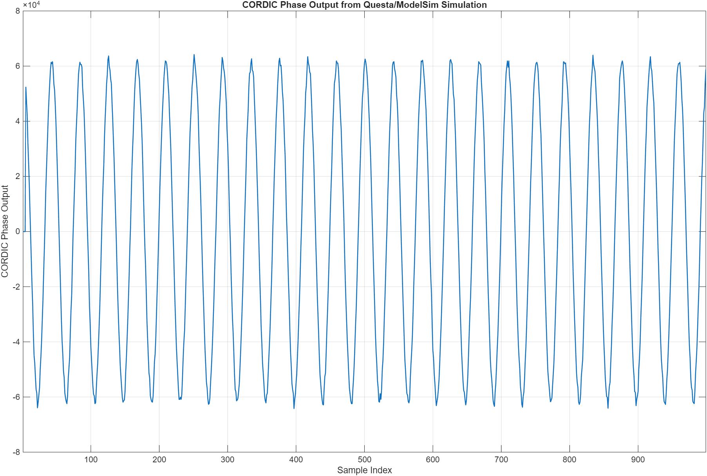

# FPGA-SDR
An FM software-defined radio receiver built from scratch, featuring a hand-built analogue RF front end feeding a **65 MS/s ADC**, with station tuning, filtering and FM demodulation performed in real time on an **Intel MAX 10 FPGA**. All digital signal processing is implemented in **SystemVerilog without vendor DSP IP**.

The receiver covers the commercial **87.5–108 MHz FM broadcast band**, using analogue RF downconversion before digitisation and FPGA-based station selection and demodulation.

The completed system successfully receives multiple live FM radio stations and outputs demodulated audio through a **PWM-based audio stage**.

## Demo

### Live FM Reception

The video below demonstrates real-time frequency selection across the FM broadcast band and reception of multiple live stations.

[▶ Watch the live FM reception demo](https://www.youtube.com/watch?v=UVz3SpmBF10)

## System Overview

  

The complete receiver combines a custom analogue RF front end, 65 MS/s ADC, Intel MAX 10 FPGA DSP chain and PWM audio output stage.

The received FM spectrum is filtered, amplified, downconverted and digitised before being processed digitally on the FPGA for station selection, filtering and FM demodulation.

**Signal path:**  
Antenna → RF Filters → LNA → Mixer → Anti-Aliasing Filter → ADC → FPGA DSP → PWM Reconstruction Filter → Audio Amplifier → Speaker

## Results

The completed receiver successfully receives approximately 10 FM broadcast stations at my test location.

Strong stations produce clear and intelligible audio with very little background noise, while weaker stations exhibit increased noise due to lower received signal strength.

The receiver was validated incrementally by testing the ADC interface, digital signal-processing stages, mixer frequency conversion and complete RF-to-audio signal chain.

## Analogue Front End

The analogue front end receives the FM broadcast band using a dipole antenna before filtering and amplifying the signal.

A custom FM band-pass filter and cascaded LP filter restrict the received spectrum to the 87.5–108 MHz broadcast band, attenuating out-of-band signals before they reach the LNA and mixer.

An **85 MHz local oscillator** is used with an analogue mixer to translate the **87.5–108 MHz** RF spectrum to an intermediate-frequency range of approximately **2.5–23 MHz**.

The resulting signal is low-pass filtered to remove high-frequency mixer sum products before being sampled by an **AD9226 12-bit ADC at 65 MS/s**.

The analogue chain consists of:

- Dipole antenna
- Custom FM band-pass filter
- Cascaded RF low-pass filter
- SPF5189Z low-noise amplifier
- AD831 active mixer
- 85 MHz local oscillator
- Custom post-mixer low-pass / anti-aliasing filter
- AD9226 12-bit ADC
  
---

## RF Filter Characterisation

### FM Band-Pass Filter

A custom LC band-pass filter was designed to pass the **87.5–108 MHz FM broadcast band** while attenuating unwanted out-of-band signals before amplification and mixing. The schematic of the circuit used is shown below.

  

The filter was constructed using Manhattan-style construction with discrete components mounted on copper-clad board and was characterised using a NanoVNA.

  

A high-resolution S21 sweep around the FM band shows that the desired passband is achieved with relatively low insertion loss across most of the band.

  

A wider frequency sweep revealed additional unwanted resonances at higher frequencies. These are caused by practical non-idealities such as component parasitics, interconnect inductance and capacitance, and the physical construction of the discrete RF filter.

  

### Additional RF Low-Pass Filter

To suppress the unwanted high-frequency responses observed in the wideband measurement, an additional RF low-pass filter was cascaded with the FM band-pass filter.

The low-pass stage was designed to preserve the required FM broadcast band while providing substantially greater attenuation at higher frequencies.

  

The cascaded filter network was characterised directly using a NanoVNA. The image below shows the measured response of the combined FM band-pass and RF low-pass filtering stages during testing.

  

The measured S21 data was then exported from the NanoVNA and plotted in MATLAB for clearer quantitative comparison.

  

The combined filter response retains the desired **87.5–108 MHz** passband while significantly reducing the unwanted high-frequency resonances.

This provided a cleaner RF spectrum to the following receiver stages and reduced the risk of unwanted out-of-band signals entering the mixer.

### Post-Mixer Low-Pass / Anti-Aliasing Filter

After analogue mixing, the 87.5–108 MHz FM broadcast band is translated using an 85 MHz local oscillator to an intermediate-frequency range of approximately **2.5–23 MHz**. 

A low-pass filter was therefore placed between the mixer and the ADC to preserve the required IF spectrum while attenuating higher-frequency mixer products before digitisation. The circuit schematic is shown below.

  

The measured S21 response shows a cutoff close to the upper edge of the desired IF band. At **23 MHz**, the filter is approximately at the edge of its passband, after which the attenuation increases rapidly. By the **32.5 MHz Nyquist frequency** of the 65 MS/s ADC, unwanted frequency components are already significantly attenuated, with substantially greater rejection at higher frequencies.

This filter therefore limits the bandwidth presented to the ADC and reduces the contribution of unwanted high-frequency mixer products and out-of-band signals that could otherwise alias into the sampled spectrum.

## FPGA Digital Signal Processing Pipeline

### ADC Interface and Clocking

The AD9226 provides a 12-bit parallel sample stream to the FPGA and is clocked at 65 MHz using an FPGA PLL. Since the highest frequency component after analogue filtering is approximately 23 MHz, the Nyquist–Shannon sampling theorem requires a sampling rate greater than 46 MS/s. Although the DE10-Lite’s 50 MHz reference clock would theoretically satisfy this, the ADC was operated at 65 MS/s to provide additional sampling margin and a wider transition band for the analogue anti-aliasing filter, reducing the required filter sharpness.

### ADC Spectrum

The figure below shows the frequency spectrum of the digitised ADC samples after the analogue front end. The expected downconverted FM signals are visible within the approximately 2.5–23 MHz IF band, confirming that the ADC interface was operating correctly and that valid sampled data was being captured by the FPGA.

The spectrum also demonstrates the effect of the analogue front end, with the received FM band confined largely to the intended frequency range and out-of-band components attenuated by the RF and anti-aliasing filters.

### Digital Downconversion to IQ samples

The sampled signal contains the complete FM broadcast spectrum translated to approximately 2.5–23 MHz. To shift this spectrum to complex baseband, the ADC samples are multiplied by a 12.75 MHz complex exponential.

This complex exponential is generated using a numerically controlled oscillator (NCO), implemented with a phase accumulator and a ROM storing sine values. The NCO produces the corresponding sine and cosine components, which are multiplied by the real ADC samples to generate the in-phase (I) and quadrature (Q) signals.

### Digital Station Tuning

Individual FM stations are selected digitally rather than by changing the analogue local oscillator.

A second tunable NCO generates a complex exponential corresponding to the frequency offset of the desired station. Complex multiplication translates the selected FM channel to approximately 0 Hz.

Changing the NCO phase increment therefore changes the tuned station while the analogue RF front end and 85 MHz local oscillator remain fixed.

This allows tuning across the FM broadcast band entirely within the FPGA.

### FIR filtering and decimation

After frequency translation, the I and Q streams pass through multiple FIR filtering stages. The first filter removes unwanted channels and limits the bandwidth before decimation, allowing the sample rate to be reduced while retaining only the selected FM channel around baseband.

A second FIR stage then provides sharper channel filtering at the reduced sample rate before FM demodulation. Performing this filtering after decimation allows the required frequency response to be achieved with far fewer FIR coefficients, significantly reducing FPGA resource usage.

### CORDIC FM demodulation

FM information is encoded in the phase variation of the complex baseband signal. Demodulation is performed by calculating the phase difference between successive samples as

$$
arg\left(x[n]x^*[n-1]\right)
$$

A CORDIC algorithm efficiently computes this argument using only shifts and additions, recovering the FM-modulated audio signal without requiring a hardware arctangent.

The recovered audio is converted to a PWM signal for output to an external analogue low-pass filter and audio amplifier before driving a speaker.

### FPGA block diagram 

### RTL Simulation and Verification

The complete digital receiver was verified in Questa using synthetic 12-bit ADC samples representing an FM signal after analogue downconversion. Known sine waves were used as the message signal, with a small amount of noise added to better represent a realistic received signal. The samples were then passed through the full RTL chain, including digital tuning, FIR filtering, decimation and CORDIC FM demodulation.

The recovered waveform closely matched the original message signal, providing end-to-end verification of the FPGA DSP pipeline.

### FPGA Resource Utilisation

The complete real-time DSP chain occupies a relatively small fraction of the
MAX 10 FPGA resources:

| Resource | Utilisation |
|---|---:|
| Logic elements | 14,985 / 49,760 (30%) |
| Registers | 8,956 |
| Memory bits | 41,960 / 1,677,312 (3%) |
| Embedded 9-bit multipliers | 131 / 288 (45%) |
| PLLs | 1 / 4 (25%) |

The design therefore fits comfortably within the available FPGA resources,
with the FIR filters and complex mixers accounting for much of the multiplier usage.

## Hardware

### Receiver Hardware

- Terasic DE10-Lite development board (Intel MAX 10 FPGA)
- AD9226 12-bit 65MS/s ADC
- AD831 active mixer
- Si5351 local oscillator
- Arduino Uno (configures the Si5351 over I²C)
- SPF5189Z LNA
- Custom FM band-pass filter and cascaded RF low-pass filter
- Custom post-mixer anti-aliasing low-pass filter
- Dipole antenna, connected via a long coax cable
- PWM audio analogue low-pass filter
- PAM8302A audio amplifier
- Speaker

### Test Equipment

- NanoVNA H4 vector network analyser
- Oscilloscope
- Digital multimeter

## Key Design Decisions

### Digital I/Q Generation

An analogue I/Q mixer was initially considered, but this would have required two ADC channels and duplicate analogue filtering.

Instead, a single real IF signal is digitised and I/Q samples are generated digitally on the FPGA, reducing hardware cost and complexity.

### 65 MS/s ADC Clock

The 23 MHz IF spectrum could theoretically be sampled at 50 MS/s, but this leaves only a small transition band before the 25 MHz Nyquist frequency.

Using a 65 MHz ADC clock increases the Nyquist frequency to 32.5 MHz, giving the analogue anti-aliasing filter much more transition bandwidth.

### Two-Stage FIR Filtering

Rather than using one very sharp FIR filter at the full sample rate, filtering is split across two stages with decimation between them.

This allows the second filter to operate at a lower sample rate, reducing the number of coefficients and FPGA resources required.

### Multiplier-Efficient FIR Architecture

The initial FIR implementation used many multipliers in parallel, resulting in high DSP resource usage.

The filters were redesigned to reuse multipliers across multiple clock cycles, greatly reducing multiplier usage while maintaining real-time throughput.

## Future improvements

Possible future extensions to the receiver include:
- Custom PCB implementation. Integrate the RF front end, ADC and supporting circuitry onto a PCB to reduce wiring, parasitics and interference compared with the current prototype.
- Improved RF sensitivity. Optimise the antenna, impedance matching and analogue gain stages to improve reception of weaker stations.
- Stereo FM decoding. Extend the DSP chain to recover the 19 kHz pilot and decode stereo left/right audio.
- Improved audio output. Replace the PWM output stage with a higher-quality DAC or FPGA-based sigma-delta converter.
